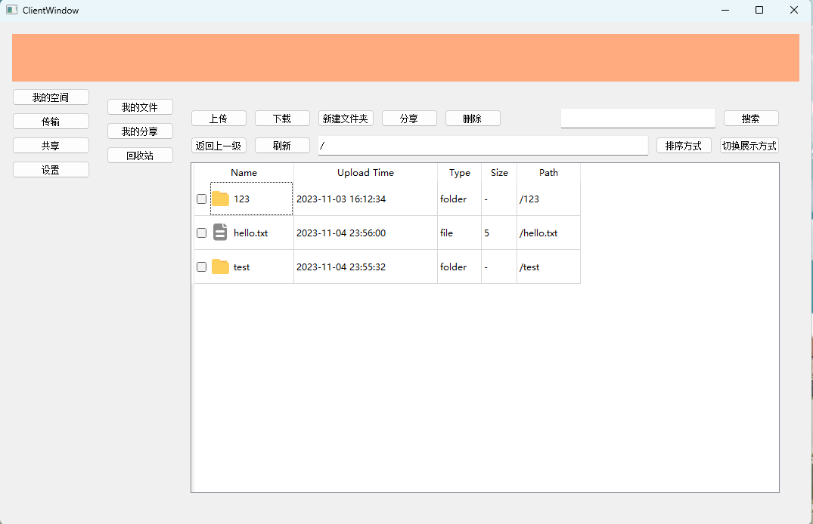

# tanCloud

## 简介
开发原因：第三方网盘数据不安全，容易泄露、被封禁；NAS成本高；很多开源私有网盘部署复杂，功能冗余。 

项目用途：本项目采用C/S架构，旨在实现一个简单、好用、跨平台的私有网盘。适合于个人、家庭、小型团队。可以用旧电脑或者价格较低的电脑充当服务器，再加上硬盘以较低的成本实现私有网盘。 
环境依赖：
- Qt5.15
- MSVC2019

## 项目设计
目前没有做界面部分代码，完成部分功能代码实现多线程服务器与单线程客户端（后续会完善成多线程客户端），自建通信协议实现客户端与服务器之间的通信以及文件传输。 

**相关代码功能在头文件中有详细注释。**
### 客户端
用户在地址框输入服务器IPv4地址或者域名，然后客户端对其进行验证，如果该地址合法，当用户点击连接服务器按钮时就对服务器发起连接请求，当与服务器成功建立连接后。 
用户输入用户名和密码进行登录注册操作。 
登录成功后，客户端跳转到主页面。
**客户端主要分为4个部分**
- 我的空间
  - 我的文件：主要实现用户对文件的操作以及展示服务器下的文件信息。
  - 我的分享：管理用户分享的文件。（暂时未实现）
  - 回收站：  暂时储存用户删除的文件，在一定时间内可以进行恢复。（暂时未实现）
- 传输：展示文件传输进度以及对传输的文件进行管理。（暂时未实现）
- 共享：类似于QQ群，共享空间内的成员可以下载空间内的文件，上传的文件通过审核后可以加入共享空间。成员可以删除自己上传的文件。（暂时未实现）
- 设置：主要是管理员对用户信息进行管理，比如用户空间大小分配等功能，暂时没想好。（暂时未实现）

#### 我的文件
- [x] 展示服务器下的文件夹中的内容
- [x] 通过复选框实现选中功能
- [x] 上传文件或者文件夹
- [x] 下载选中的文件或者文件夹
- [x] 新建文件夹
- [x] 删除选中的文件或者文件夹
- [x] 双击进入文件夹
- [x] 显示用户所在文件夹地址
- [x] 返回上一级地址
- [x] 刷新列表 
- [x] 页面跳转 
- [ ] 通过文件名搜索文件
- [ ] 切换列表排序方式
- [ ] 在表格展示方式与缩略图之间切换 

### 服务器
服务器程序运行后持续监听52996这个端口，当有新的连接请求到来时就为这个连接创建一个新的线程用来处理客户端请求。线程运行后，每当有可读信息就进行处理，并将处理结果返回给客户端。 
```mermaid
graph TD
client[客户端]
server[服务器]
thread

client -- 连接 -->server
server -- 连接成功 --> thread
client -- 请求 --> thread
thread -- 响应 -->client
```
在整个项目中，信息分为两种。一种是请求信息，用来传递客户端的请求与服务器的处理结果。一种是文件信息，是服务器与客户端之间正在传输文件。 
同时客户端与服务器也分为接收请求状态与传输文件状态(客户端与服务器名称可能由区别)，状态之间的转换类似于tcp建立连接的过程。 

比如客户端要上传文件。首先发送文件传输请求，将文件信息上传给服务器。 
服务器判断这个文件能否上传，将结果返回给客户端。 
客户端将结果展示到界面，由用户决定是否上传。 
如果用户确认上传，则客户端发送确认信息给服务器，同时修改客户端状态为上传文件状态，然后上传文件。服务器收到确认信息后，修改服务器状态为接收文件状态。 
当服务器接收完成时，退出接收文件状态，发送接收完成信息给客户端，客户端退出上传状态。下载过程类似。
```mermaid
graph TD
client[客户端]
server[服务器]
req[请求状态]
res[响应状态]
upload[上传状态]
receive[接收状态]

client --> req
server --> res
req -- 1.上传文件请求 ---> res
res -- 2.结果 --> req
req -- 3.确认上传 --> res
res -- 3.确认上传 --> receive
req -- 3.确认上传 --> upload
upload -- 4.上传文件 -----> receive
receive -- 5.接收完成 ----> res
receive -- 5.接收完成 -->req
```

### 上传部分
```mermaid

flowchart TB
user[用户]
client[客户端]
server[服务器]
select{上传文件\n或者文件夹}
uploadFile[上传文件]
uploadFolder[上传文件夹]
canUpload{判断能否上传}
folderQueue[文件夹队列]
fileQueue[文件队列]
pushSelect[将选中的文件夹\n加入文件夹队列]
pop[队首出队]
foreach[遍历当前文件夹]
user --> select
fileType{文件类型}
endForeach[完成遍历]
fileEmpty{文件队列\n是否为空}
folderEmpty{文件夹队列\n是否为空}

%% 上传文件部分
select -- 选择文件 --> client
client -- 选择文件--> uploadFile
uploadFile -- 1. 文件大小 目标路径 ---> server
server -- 2 --> canUpload
canUpload --> server
server -- 3. 返回结果 --> uploadFile
uploadFile -- 4. 确认上传 --> server
uploadFile -- 5. 上传文件头\n和文件内容 --> server
server -- 6. 完成接收\n返回提示信息 --> uploadFile

%% 上传文件夹部分
select -- 选择文件夹 --> client
client -- 选择文件夹 --> pushSelect
pushSelect --> uploadFolder
uploadFolder --> pop --> 在服务器目标位置\n创建文件夹
pop --> foreach
foreach --> fileType
fileType -- 文件 --> fileQueue --> endForeach
fileType -- 文件夹 --> folderQueue --> endForeach
endForeach --> fileEmpty
endForeach --> folderEmpty
fileEmpty -- 非空,按顺序上传文件\n直到文件队列清空 --> uploadFile
fileEmpty -- 空 --> folderEmpty
folderEmpty -- 非空 --> uploadFolder
folderEmpty -- 空 --> 结束上传
```

### 下载部分
```mermaid
graph TB
user[客户端]
client[客户端]
server[服务器]
downQueue[下载队列]
foreachDown[遍历下载队列]
fileType{文件类型}
fileQueue[文件队列]
folderQueue[文件夹队列]
endForeach[完成遍历]
isFileEmpty{文件队列\n是否为空}
isFolderEmpty{文件夹队列\n是否为空}
downFile[下载文件]
popFolder[弹出文件夹队列\n队首元素]
fileType2{文件类型}

user -- 选择下载文件 --> downQueue
downQueue --> client
client --> foreachDown
foreachDown --> fileType
fileType -- 文件 --> fileQueue --> endForeach
fileType -- 文件夹 --> folderQueue --> endForeach
endForeach --> isFileEmpty
isFileEmpty -- 非空,按顺序执行\n下载操作直到清空文件队列 --> downFile
isFileEmpty -- 空 --> isFolderEmpty

%% 下载文件部分
downFile -- 1.目标路径 --> server
server --- 判断能否下载 --> server
server -- 2.返回结果 --> downFile
downFile -- 3.确认下载 --> server
server -- 4.文件头 文件内容 --> downFile

%% 下载文件夹部分
isFolderEmpty -- 空 --> 结束下载
isFolderEmpty -- 非空 --> popFolder
popFolder --> 在目标下载位置创建文件夹
popFolder --- 遍历服务器中的这个文件夹 --> fileType2
fileType2 -- 文件 --> 文件队列 --> 完成遍历 
fileType2 -- 文件夹 --> 文件夹队列 --> 完成遍历
完成遍历 --> isFileEmpty
```